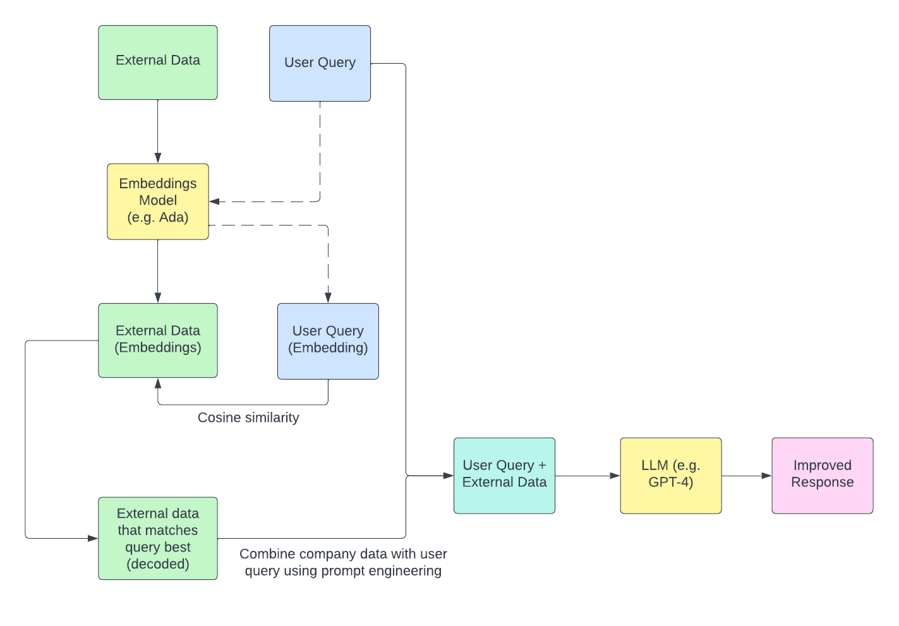

<a name="top"/>

# How to Build and Deploy a RAG Model from Scratch

The goal of this project is to build a simple RAG (Retrieval-Augmented Generation) model and deploy it. To begin, let's start out with some definitions to better understand the principles behind RAG models as well as some of the foundational architecture we will use to quickly deploy it. We will use Docker to make it easy to deploy in any environment, OpenSearch for storing external data, and Streamlit to interact with the model. 

Note that the majority of the code used in this project as well as the documentation for this README was generated using [ChatGPT 4o](https://chatgpt.com/).

### Table of Contents
- [Prompt Engineering](#prompt-engineering)
   - [Prompt Engineering Example](#prompt-engineering-example)
- [Retrival-Augmented Generation](#rag)
- [Docker](#docker)
- [Streamlit](#streamlit)
- [OpenSearch](#opensearch)

<a name="prompt-engineering"/>

## Prompt Engineering

<a href="#top">Go to top</a>

<b>Prompt engineering</b> is the process of designing and optimizing prompts (input text or queries) given to AI models (like GPT-3, GPT-4, or other LLMs) to achieve a specific, desired response.

It involves crafting questions, statements, or instructions in ways that guide the model to produce responses that are relevant, accurate, and useful for a given task.

### Key Aspects of Prompt Engineering

1. **Input Structuring**: Crafting the input to clearly specify what the model should do. For example, a prompt could be framed as a question, a command, or a set of instructions.
   - **Example**: For a model trained to generate code, a prompt like "Write a Python function to reverse a list" would be more effective than simply saying "Python list."

2. **Context Setting**: Providing context within the prompt helps the model better understand the background or constraints.
   - **Example**: If you need a model to generate text in a particular tone or style, adding context like "Write a motivational message for a tech startup founder" will guide the output's tone.

3. **Iterative Refinement**: Often, the first prompt does not yield the best response. Prompt engineering involves refining and experimenting with prompts iteratively to improve the quality and accuracy of responses.
   - **Example**: Testing variations like "Explain X to a beginner," "Summarize X in one sentence," or "List the pros and cons of X."

4. **Using Instructions and Constraints**: Setting explicit instructions or constraints within the prompt can help in obtaining more structured and specific responses.
   - **Example**: Asking, "List three reasons why renewable energy is important" will likely yield a more concise answer than an open-ended question like "Why is renewable energy important?"

5. **Chaining Prompts**: Breaking down a complex task into multiple smaller prompts, each handling a part of the task, can make responses more accurate. This is known as "prompt chaining."
   - **Example**: For a multi-step task like "Provide a summary, then list key takeaways," chaining prompts helps maintain structure.

6. **Meta-Prompts**: Prompts that explicitly tell the model how to act or think, sometimes even with simulated reasoning steps.
   - **Example**: "Think through each step logically before answering the question."

<a name="prompt-engineering-example"/>

## Prompt Engineering Example

How to generate better images by improving the details in the prompt message.

<a href="#top">Go to top</a>

Using ChatGPT 4o, the prompt: 

<b>Generate an image of a tree</b>

yields the following image and response:

Here is the generated image of a single tree in a natural setting. Let me know if you'd like any changes!

Using ChatGPT 4o, the prompt: 

<b>Generate an image of a tree in the middle of fall, when the leaves have started to fall and the colors of the leaves are a mix of greens, yellows, and browns</b>
 

yields the following image and response:

Here is the generated image of a tree in a suburban neighborhood during the middle of fall, with leaves in shades of green, yellow, and brown. Let me know if you need any adjustments!

<a name="rag"/>

## Retrieval-Augmented Generation

<a href="#top">Go to top</a>

<b>Retrieval-Augmented Generation (RAG)</b> is a method used in natural language processing that combines <i>retrieval</i> of relevant information with <i>generation</i> of natural language responses.
 It enables large language models (LLMs) to generate more accurate, contextually relevant, and informed answers by incorporating external knowledge into the response process. RAG is particularly valuable in applications where the model needs to generate responses based on a large knowledge base or document set, such as in customer service, question answering, and summarization tasks.

### Key Components of Retrieval-Augmented Generation

1. **Retriever**:
   - The retriever is responsible for finding relevant information from a large dataset or document store. This step usually involves using a search mechanism or embeddings-based similarity to fetch the most relevant documents, paragraphs, or text snippets.
   - For example, if a user asks a question, the retriever will search through a database of documents to find those that likely contain answers to that question.

2. **Generator**:
   - The generator is typically a large language model (like GPT-3, GPT-4, or other open-source models) that generates responses based on the information retrieved.
   - The retrieved information is combined with the user’s input prompt and fed to the generator, which synthesizes a cohesive response using this enriched context.

### How RAG Works

The basic workflow of a RAG system is as follows:

1. **User Query**: A user submits a question or prompt.
2. **Retrieval Step**: The retriever searches a database or knowledge base to find relevant documents or snippets that may contain information relevant to the question.
3. **Prompt Engineering**: The retrieved information and the original query are combined into a well-structured prompt to help the generator produce an accurate and context-rich answer.
4. **Generation Step**: The generator takes the prompt with the retrieved information and generates a response, synthesizing the information from the documents to create a comprehensive answer.
5. **Response Output**: The final output is presented to the user as an answer that is both generated by the model and informed by the knowledge base.

<a name="docker"/>

## Docker

<a href="#top">Go to top</a>

<b>Docker</b> is an open-source platform that enables developers to automate the deployment, scaling, and management of applications inside lightweight, portable containers.
 These containers bundle everything needed to run an application, including the code, runtime, libraries, and dependencies, making it easier to develop, ship, and run applications consistently across different environments.

### Key Concepts in Docker

1. **Containers**:
   - Containers are lightweight, standalone executable packages that contain all the components necessary to run a piece of software, including the code, libraries, and system tools.
   - Unlike virtual machines, containers share the host operating system’s kernel, making them more resource-efficient and faster to start.

2. **Docker Images**:
   - An image is a blueprint for a container and contains the application code, dependencies, and the runtime environment. It’s a static, read-only file that forms the foundation for a Docker container.
   - Images are built from a `Dockerfile` (a script containing instructions to assemble the image) and can be stored in a registry like Docker Hub.

3. **Dockerfile**:
   - A Dockerfile is a text file that contains commands to assemble an image. It specifies the operating system, dependencies, and other setup steps needed to create a customized image for the application.

4. **Docker Hub and Registries**:
   - Docker Hub is a cloud-based registry service for finding and sharing Docker images. Developers can pull pre-built images from Docker Hub or push their own images for others to use.

5. **Docker Compose**:
   - Docker Compose is a tool for defining and running multi-container Docker applications. It uses a YAML file to configure the application's services, making it easy to manage complex applications with multiple services (e.g., a web server and a database).

### How Docker Works

- **Building**: Docker builds images from Dockerfiles. A developer writes a Dockerfile with instructions for setting up the environment, installing dependencies, and copying application code.
- **Running**: Once the image is built, a container can be created and run from the image. The container isolates the application from the host, ensuring consistent performance regardless of where it’s running.
- **Portability**: Since Docker packages applications and dependencies into a single container, they can run consistently across any system that supports Docker, whether it’s a developer’s laptop, a testing server, or a production environment in the cloud.

### Why Docker is Useful

1. **Environment Consistency**: Docker ensures that applications run the same way across different environments, reducing “it works on my machine” issues.
2. **Isolation**: Each container is isolated from others, enabling multiple containers to run different applications on the same host without conflicts.
3. **Resource Efficiency**: Docker containers are lightweight and share the host OS kernel, so they use less memory and storage than traditional virtual machines.
4. **Scalability**: Docker containers can be scaled easily across distributed systems, making them well-suited for microservices architectures.
5. **Developer Productivity**: Docker accelerates the development workflow by enabling rapid deployment and testing, faster code updates, and improved collaboration.

<a name="streamlit"/>

## Streamlit

<a href="#top">Go to top</a>

<b>Streamlit</b> is an open-source Python library that makes it easy for developers and data scientists to build and deploy interactive web applications, including apps for data analysis or interacting with large language models.
 Streamlit simplifies the process of creating user interfaces for data science projects by enabling you to build a front end in Python, without needing extensive web development skills.

### Key Features of Streamlit

1. **Easy Setup**:
   - Streamlit apps are created using simple Python scripts. You don’t need to learn HTML, CSS, or JavaScript—Streamlit handles the front end.
   - You can create interactive web apps with just a few lines of code.

2. **Widgets for Interactivity**:
   - Streamlit offers built-in widgets, like sliders, checkboxes, and select boxes, to make applications interactive.
   - These widgets allow users to adjust parameters, input data, and update visualizations in real-time without reloading the app.

3. **Data Visualization Support**:
   - Streamlit integrates seamlessly with popular Python data visualization libraries like **Matplotlib**, **Plotly**, **Altair**, and **Seaborn**.
   - It can render a variety of interactive visualizations, charts, and maps.

4. **Live Code Reloading**:
   - Streamlit automatically refreshes the app when you update the code, making it fast to iterate and test.
   
5. **Integration with Machine Learning Models**:
   - You can use Streamlit to deploy machine learning models built with frameworks like **Scikit-Learn**, **TensorFlow**, and **PyTorch**.
   - By loading a model in Streamlit and using interactive widgets for inputs, you can create a simple web app to showcase and test your models in real-time.

6. **Support for Data and Text Display**:
   - Streamlit makes it easy to display data using tables, data frames, and Markdown, so you can build dashboards and reports that blend visuals with explanations.

In summary, Streamlit is a powerful tool for turning data and models into interactive web applications, making it ideal for data science, machine learning, and prototyping applications with minimal setup.

<a name="opensearch"/>

## OpenSearch

<a href="#top">Go to top</a>

<b>OpenSearch</b> is an open-source search and analytics suite that enables users to perform advanced search, monitoring, and analysis tasks on large volumes of data.
 Originally derived from Elasticsearch and Kibana, OpenSearch was developed by Amazon Web Services (AWS) as a community-driven, Apache 2.0 licensed alternative. It offers capabilities for full-text search, log and event data analysis, and real-time analytics, commonly used in application monitoring, security monitoring, and business intelligence.

### Key Components of OpenSearch

1. **OpenSearch Core (Search and Indexing Engine)**:
   - Provides a powerful, scalable search engine that allows users to index, search, and analyze data in near real-time.
   - It supports full-text search, structured search, and complex query functionality, enabling users to search through and analyze large datasets efficiently.
   - Allows users to build sophisticated search applications with features like multi-tenancy, role-based access control, and fine-grained security.

2. **OpenSearch Dashboards**:
   - An interactive visualization and exploration tool, originally derived from Kibana.
   - Provides a graphical interface to interact with the data in OpenSearch, allowing users to create dashboards, visualizations, and alerts.
   - Dashboards support various chart types and visualizations, enabling comprehensive data exploration and reporting.

### Key Features of OpenSearch

1. **Search and Query Capabilities**:
   - Supports complex queries, including full-text search, keyword matching, and aggregations for grouping and summarizing data.
   - Offers features like phrase matching, relevance tuning, and filtering, which are especially useful in applications like e-commerce search, document search, and recommendation engines.

2. **Real-Time Analytics**:
   - OpenSearch is designed to handle time-series data, making it ideal for monitoring logs, metrics, and other real-time data.
   - Supports aggregations, statistical functions, and custom visualizations, which can be used to monitor application performance, track trends, and detect anomalies.

3. **Security Features**:
   - Offers fine-grained access control, data encryption, and support for multi-tenancy, allowing different users to access data securely within the same cluster.
   - Integrates with authentication providers like LDAP, Active Directory, and SAML, and provides detailed audit logs to monitor user actions.

4. **Indexing and Storage**:
   - Provides efficient data indexing and storage, allowing for rapid retrieval and storage of large datasets.
   - Supports different types of data, including JSON documents and structured data, and can handle multi-tenant use cases where each tenant has separate indices.

5. **Machine Learning and Anomaly Detection**:
   - Includes built-in machine learning algorithms for anomaly detection and other predictive analytics tasks.
   - Enables users to detect unusual patterns in time-series data, such as identifying spikes or drops in application metrics or monitoring for potential security threats.

### OpenSearch Architecture and Workflow

1. **Data Ingestion**:
   - Data is ingested into OpenSearch either in bulk or in real-time via APIs or integrations with tools like Logstash, Fluentd, and Beats.
   - Ingest pipelines can be configured to preprocess data (e.g., transforming or enriching data) before indexing.

2. **Indexing and Storage**:
   - Data is stored in indices, which are organized collections of documents. Each document can contain structured or unstructured data.
   - The data is indexed to allow for fast, efficient searches across large datasets.

3. **Querying and Analysis**:
   - Users can run queries to search for specific records or perform aggregations to analyze trends and patterns.
   - Query results can be visualized in OpenSearch Dashboards, where users can explore data interactively.

4. **Monitoring and Alerting**:
   - OpenSearch offers real-time monitoring of data, with alerting features that allow users to set triggers based on specific conditions.
   - Alerts can be configured to notify users through channels like email, Slack, or webhooks when certain thresholds are met.

### Common Use Cases for OpenSearch

1. **Log and Event Analytics**:
   - OpenSearch is widely used for analyzing logs and events in IT infrastructure, security monitoring, and application performance monitoring (APM).
   - It allows organizations to quickly search and analyze logs to detect issues, monitor system health, and troubleshoot problems.

2. **Search Applications**:
   - Used to build custom search applications in e-commerce, media, and publishing where users need to search large datasets of documents or records.
   - Its relevance tuning, faceted search, and full-text search capabilities make it a popular choice for high-performance search applications.

3. **Business Intelligence and Data Visualization**:
   - Enables users to visualize and explore data, with the ability to create dashboards that monitor key metrics, detect trends, and generate insights.

4. **Anomaly Detection**:
   - Helps in detecting unusual patterns or events in time-series data, such as spotting potential security threats, detecting fraud, or identifying operational anomalies.

### Advantages of OpenSearch

- **Open Source**: OpenSearch is fully open-source and licensed under the Apache 2.0 license, allowing users to modify and extend it freely.
- **Scalability**: It is designed to handle large datasets and can scale horizontally by adding nodes to a cluster.
- **Flexibility**: Supports a wide range of data types and use cases, from full-text search to log analysis and time-series monitoring.
- **Community-Driven**: OpenSearch has an active community, ensuring continuous development, feature improvements, and support.

In summary, OpenSearch is a powerful, open-source search and analytics platform designed to help organizations search, analyze, and visualize large volumes of data across various domains. Its capabilities make it well-suited for applications involving search, data monitoring, and real-time analytics.

